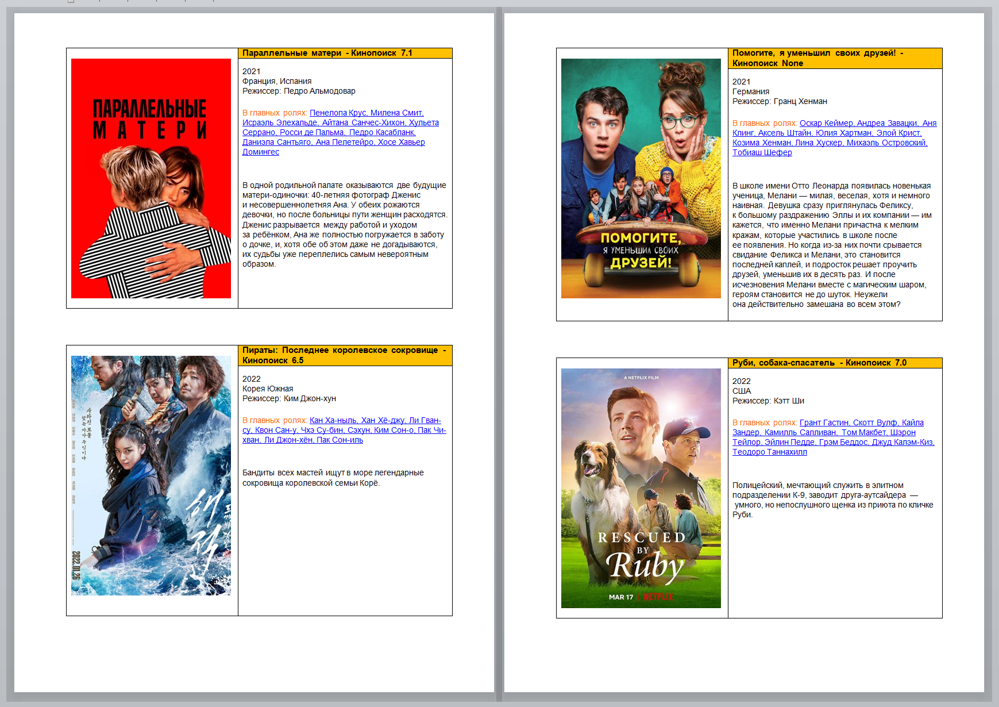

# Kinolist

Kinolist это скрипт на Python для быстрого создания списка фильмов в вормате `docx`. Также позволяет прописывать теги в видеофайлы `mp4` по данному списку.

* Информацию о фильмах получает с сайта [Kinopoisk.ru](https://www.kinopoisk.ru) используя [неофициальный API](https://kinopoiskapiunofficial.tech).
* Для взаимодействия с неофициальный API используется модуль [inopoisk-api-unofficial-client](https://github.com/masterWeber/kinopoisk-api-unofficial-client)
* Для создания и редактирования файлов `docx` используется библиотека [python-docx](https://github.com/python-openxml/python-docx)
* Для записи теков применяется библиотека [mutagen](https://mutagen.readthedocs.io/)

## Настройка и подготовка

### 1. Установка зависимостей
    pip install -r requirements.txt 

### 2. Получение и установка api-key
Для получения токена необходима регистрация на сайте
[kinopoiskapiunofficial.tech](hrrps://kinopoiskapiunofficial.tech). После регистрации перейдите в
настройки своего профиля и сохраните токен. После этого необходимо создать модуль `config.py` и прописать свой api-key:

    api_key = 'your api key'

### 3. Подготовка фаайла list.txt
kinipoisk_id - идентификатор фильма на Кинопоиске. В файле `list.txt` должны находиться идентификаторы каждого фильма на отдельной строке. Если `list.txt` отсутствует, есть возможность ввести идентификаторы фильмов с клавиатуры через пробел.

### 4. Запись тегов
Для записи тегов файлы mp4 должны находиться в папке с программой, и должны быть переименованы в соответиствии с названями на Кинопоиске (за исключением запрещенных спецвимволов: `\/:*?"<>`). Автоматически заполняются следующие теги:
1. Название фильма
2. Год
3. Описание
4. Вставляется обложка 

В папке `covers` сохраняются обложки фильмов. 

## Пример работы
Содержимое каталога:
```
config.py
kinolist.py
list.txt
template.docx
Параллельные матери.mp4
Пираты Последнее королевское сокровище.mp4
Помогите, я уменьшил своих друзей!.mp4
Руби, собака-спасатель.mp4
```

Содержимое `list.txt`:

    1390810
    1219241
    1339535
    4671515

Результат выполнения скрипта - файл `list.docx`:




